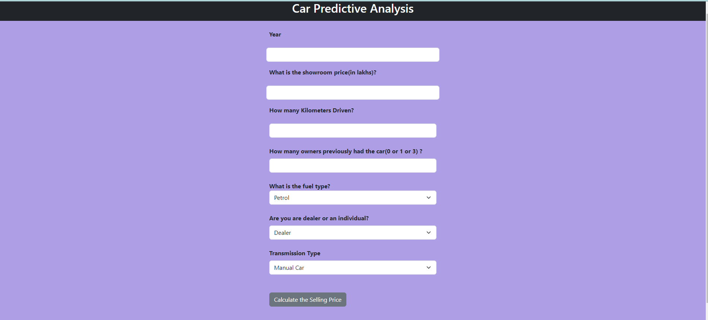

# Car_Price_Prediction_App

It is a Machine Learning based flask application that is used to predict the selling prices of used car.
It uses random forest regressor algorithm for building the model.The frontent of the application is build using HTML, CSS and Bootstrap and has a form-based interface where the user can input the values and get predcition. The backend uses flask API to incorporate saved model along with the html file.

## Features

- The form has various fields where the user can input values such as Car manufacturing year, showroom price, kms driven,fuel type, ownership type and fuel type. Based on these factors users can get a predcition about the selling price of their car (in lakhs)

## Ouput

